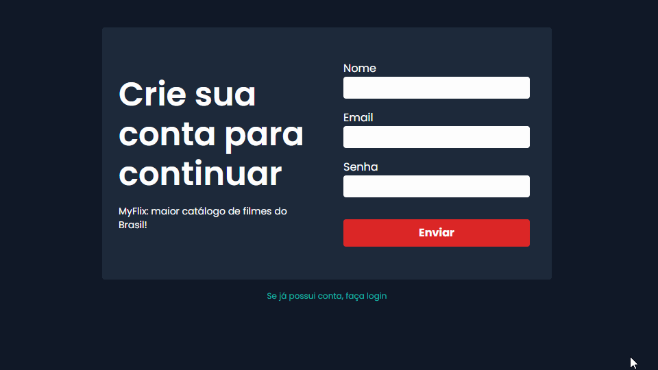

# Simple Login System

Um sistema simples de login, construído com NextJS, Prisma e SQLite. É possível criar uma conta, realizar login e resetar a senha.

## ✨ Preview

## 🛠 Builded with

##  About me

- 👤 Bacharel em jornalismo se aventurando pelo mundo da programação, estudando stacks relacionadas ao front-end, focado em ReactJS

- 🔭 Me encontre:  